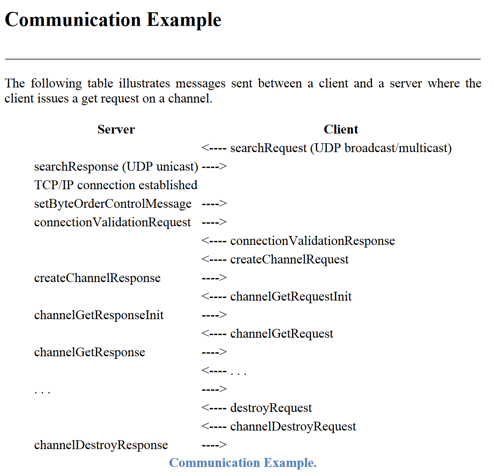

# SnowSignal
SnowSignal is designed to create a mesh network between instances of the program that will listen for UDP broadcasts received on one node of the network and rebroadcast on all other nodes.


[](https://gitlab.stfc.ac.uk/isis-accelerator-controls/playground/ivan/infrastructure/snowsignal/-/commits/main) 
[](https://gitlab.stfc.ac.uk/isis-accelerator-controls/playground/ivan/infrastructure/snowsignal/-/commits/main)

[[_TOC_]]

## Usage
### General
Command line and environment variable options. Environment variables are defined in square brackets like `[env var: THIS]`. In general, command-line values override environment variables which override defaults.
``` 
usage: snowsignal.py [-h] [-t TARGET_INTERFACE] [-b BROADCAST_PORT] [-m MESH_PORT]
                     [--other-relays OTHER_RELAYS [OTHER_RELAYS ...]]
                     [-l {debug,info,warning,error,critical}]
```
#### Target Interface
```
  -t TARGET_INTERFACE, --target-interface TARGET_INTERFACE
                        Target network interface [env var: TARGET_INTERFACE]
```
At this time SnowSignal only supports using a single network interface for receiving UDP broadcasts, sending to other relays, and rebroadcasting UDP messages received from other relays.
Defaults to `eth0`.

#### Broadcast Port
```
  -b BROADCAST_PORT, --broadcast-port BROADCAST_PORT
                        Port on which to receive and transmit UDP broadcasts [env var: BDCAST_PORT]
```
SnowSignal listens for UDP broadcasts on a single port and rebroadcasts messages received from other SnowSignal instances on the same port. Defaults to port 5076.

#### Mesh Port
```
  -m MESH_PORT, --mesh-port MESH_PORT
                        Port on which this instance will communicate with others via UDP unicast [env var:
                        MESH_PORT]
```
UDP port on which to listen for messages from other SnowSignal instances. Defaults to port 7124.

#### Other relays
```
  --other-relays OTHER_RELAYS [OTHER_RELAYS ...]
                        Manually select other relays to transmit received UDP broadcasts to
```
Manually set a list of other SnowSignal instances with which to communicate. In Docker Swarm SnowSingal is capable of auto-discovering instances if the `SERVICENAME` environment variable is set, see "Mesh Network" below. If no other relays are defined via any of these means then SnowSignal will communicate with itself for testing purposes. Default is an empty list.

#### Log Level
```
  -ll {debug,info,warning,error,critical}, --log-level {debug,info,warning,error,critical}
                        Logging level [env var: LOGLEVEL]
```
Set the logging level.

### Docker Swarm
If run in a Docker Swarm then the default configuration should work well with PVAccess. 

There is an additional requirement that the environment variable SERVICENAME be set with the Swarm service's name, e.g. 
```
    environment:
      SERVICENAME: '{{.Service.Name}}'
```

This allows each node in the service to automatically located and connect to the other nodes. The mesh will automatically heal as members enter and leave.

### Limitations ###
At this time this code has only been tested in Linux containers.

The `UDPRelayTransmit` class requires a raw socket to operate as it needs to 
1. Filter out UDP broadcasts with an Ethernet source originating from the local relay. The Ethernet source is rewritten to allow this filtering while the IP source is left alone.
2. Differentiate UDP broadcast from UDP unicast messages, ignoring the latter.

These require Level 1 and 2 access and thus raw sockets. As the Python socket package does not support such access on Windows it has not been possible to make this tool compatible with that OS. (An earlier version using ScaPy was compatible.)

## The Problem
The EPICS PVAccess protocol uses a mixture of UDP broadcast, UDP unicast and TCP (in roughly that order) to establish communication between a client and a server. In the case relevant to this package a client makes a query for a PV and its value (or some other field), e.g. a pvget while the server holds the requested PV.

The image below gives an example of the communication between a client and server and is taken from the [PVAccess Protocol Specification](https://epics-controls.org/wp-content/uploads/2018/10/pvAccess-Protocol-Specification.pdf). 



The relevant part for this problem is the initial searchRequest - a UDP broadcast / multicast. (Although the specification requires multicast support at this time I have only ever seen broadcast used.) When a pvget (or equivalent) is performed the first step is a UDP broadcast search request, i.e. a cry to local machines asking if they have the requested PV. If any do they will reply back to the requesting process with a UDP unicast and establish a TCP connection to exchange information.

UDP broadcasts are restricted to the network segment of the network interface conducting the broadcast. This means that search requests will not reach machines not on the same network segment. Alternative means suchs as a PVA Gateway or `EPICS_PVA_NAME_SERVERS` must be used in such circumstances. Note that 
-  PVA Gateway allows communication between isolated network segments but all subsequent communications must pass through the Gateway, i.e. a many to one to many topology is implicitly created.
- `EPICS_PVA_NAME_SERVERS` requires only that TCP communication between server and client be possible, but requires servers to be specified in advance.

However, if unicast communication between two network segments is possible then we could simply relay the UDP broadcasts between the two networks, allowing UDP unicast and TCP communication to proceed as usual.

This is the purpose of SnowSignal. It relays UDP broadcasts received on a specified port to other instances of SnowSignal (i.e. forming a mesh network) that then rebroadcast those UDP broadcasts on their own network segments.

**Note**: PVAccess server UDP beacon messages also use UDP broadcast and will be relayed by SnowSignal. Their purpose and consequences is not explored further here.

### Docker Swarm and Docker Networks
A docker swarm network may be created which crosses transparently between the nodes in the swarm. However, at the time of writing, docker swarm networks do not support UDP multicast or broadcast. 

For PVAccess this means that search requests are isolated to individual nodes in the swarm. A pvget to a server-container on the same node will succeed, while one to a server-container on another node will fail. (Assuming that PVA Gateway or `EPICS_PVA_NAME_SERVERS` is not used to overcome this limitation.)

## Implementation
SnowSignal is implemented in Python using base Python except for the libraries [ConfigArgParse](https://pypi.org/project/ConfigArgParse/) and [psutil](https://pypi.org/project/psutil/). The [scapy](https://scapy.readthedocs.io/en/latest/) library is used in integration and unit tests to create, send, receive, and manipulate UDP packets. 

The SnowSignal code is in two main parts:

### 1. udp_relay_transmit
The UDPTransmitRelay class uses a raw socket to monitor for UDP broadcasts on the specified UDP port and local interface. A set of filter functions are used to filter out broadcasts either originating from local interfaces' MAC addresses or from the local IP addresses. This prevents us from reacting to our own UDP broadcasts.

If a UDP broadcast packet passes the required filters then the whole packet is sent to the other SnowSignal instances in the mesh network. They will subsequently rebroadcast it.

### 2. udp_relay_receive
A UDPReceiveRelay class listens for UDP unicast messages received on a specified port and broadcasts those messages on a specified local interface. The class is an implementation of the asynchio [DatagramProtocol](https://docs.python.org/3/library/asyncio-protocol.html#datagram-protocols) run by using [loop.create_datagram_endpoint()](https://docs.python.org/3/library/asyncio-eventloop.html#asyncio.loop.create_datagram_endpoint). 

When a UDP message is received from another SnowSignal its payload is turned into a UDP broadcast packet. We change only the Ethernet source MAC address of packet, setting it to that of the interface that will be used to send it. This means that it can be filtered out by the `udp_relay_transmit` and we do not create packet storms. 

### Mesh Network
The SnowSignal mesh network may be manually specified. 

However, in a Docker Swarm environment we can identify the other services by using the DNS entries for `{{.Service.Name}}.tasks`. We then need only remove this nodes IP address from that list to get the other nodes in the mesh. We update the list of mesh nodes from this source every 10 seconds which allows us to accomodate container restarts or migrations and even, in theory, nodes entering and leaving the swarm.

### Observations and Lessons Learned
A number of issues arose as I was developing this utility: 
- I originally attempted to be clever around preventing a UDP broadcast storm by using a hashes of the UDP packets broadcast by a node member and then rejecting broadcast messages that were subsequently received by the same node. (More specifically a time-to-live dictionary so that packets weren't banned forever.) This proved overly complex and the current implementation simply filters out UDP broadcasts with sources with the same MAC address as the individual nodes.
- A PVAccess search request includes the IP address and ephemeral port that the unicast UDP reply should use. Experience shows that implementations ignore this in favour of the packet UDP source IP and port. This is why it's ultimately simpler to copy the whole packet and alter it rather than send the payload and construct a new packet around it.

## Origin of Name
A sensible name for this program would be UDP Broadcast Relay, e.g. UBrR. And brr is being cold. Hence with some helps from a name generator the name SnowSignal.