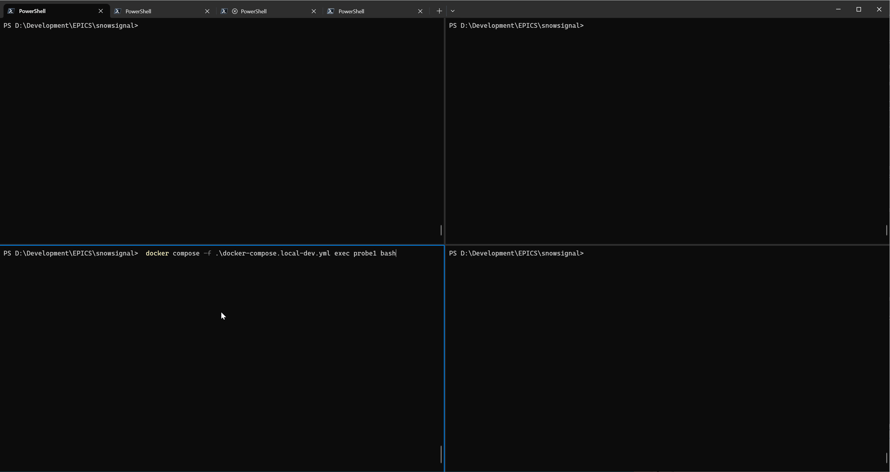

# Local Testing with Docker Compose
Unfortunately it's not easy to test SnowSignal locally as it's hard to setup an environment in which UDP broadcast traffic is blocked but TCP and UDP unicast work as normal. The system in the `docker-compose.local-dev.yml` makes a limited attempt to simulate this by creating four containers and two networks. The two probe containers are isolated from one another and are used to send and receive UDP broadcast messages. The server containers are intended for running and developing (hence the volume mount) SnowSignal.

```
-----------------------------------------
probe1 --> server1 --> server2 --> probe2
-----------------------------------------
udptest1___________||
        ||_______________________udptest2
```

probe1 and server1 are in the udptest1 network and can therefore communicate. 
server1, server2, and probe2 are in the udptest2 network. 

When a UDP broadcast message is sent by container probe1 the only other container that can see it is server1. Server1 is able to communicate with server2 so it can send UDP unicast messages to it. On receipt of a message from server1, server2 can resend it as a UDP broadcast message which probe2 can detect.

Unfortunately probe1 and probe2 cannot communicate with each other via UDP unicast or TCP so PVAccess between them is impossible.

## Tools
As well as SnowSignal two additonal tools are installed in the probe containers. 

`socat` is used to create UDP broadcast messages. The command
```
socat - udp-datagram:255.255.255.255:5076,broadcast
```
will allow a user to type text and press enter to send it as the payload of a UDP broadcast message.

`tcpdump` is used to show a raw dump of received network packets. This command line 
```
tcpdump -e -i eth0 udp and broadcast -vv -X
```
will produce a dump of a UDP broadcast packet received on network `eth0`, including the ethernet frame (`-e`), much extra detail if interpretable (`-vv`), and both hex and ASCII of the packet data (`-X`).

## Demo
This demo uses [Windows Terminal in a four pane](https://learn.microsoft.com/en-us/windows/terminal/panes) setup. 


`socat` and `tcpdump` commands as detailed above are run in containers probe1 and probe2 respectively.

Although in the demo the server1 container SnowSignal is started using the command 
```
python -m src.snowsignal --other-relays 172.27.0.2 -ll debug
```
it is easier to use
```
python -m src.snowsignal --other-relays server2 -ll debug
```
which means the IP address of server2 does not need to be determined in advance.

The server2 instance of SnowSignal is started using the command
```
python -m src.snowsignal -ll debug
```